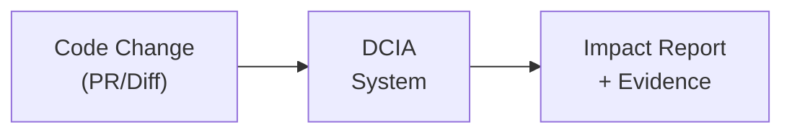
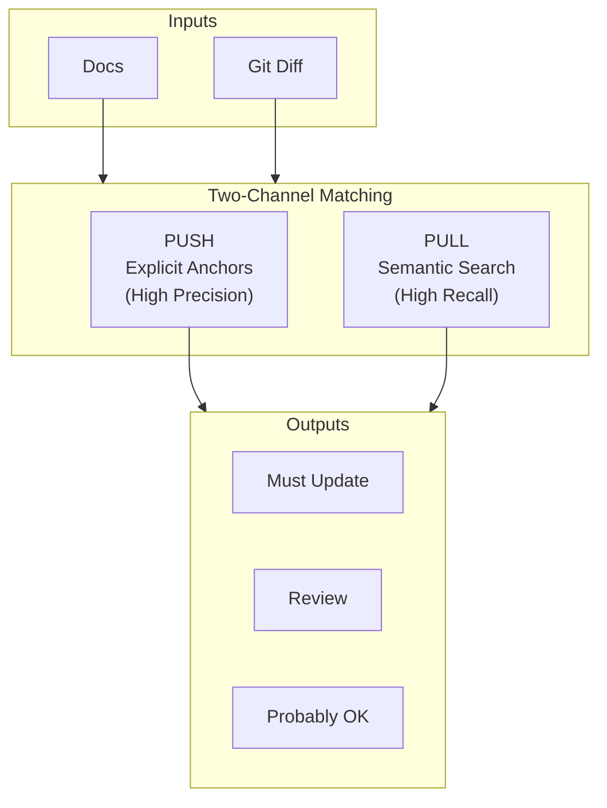
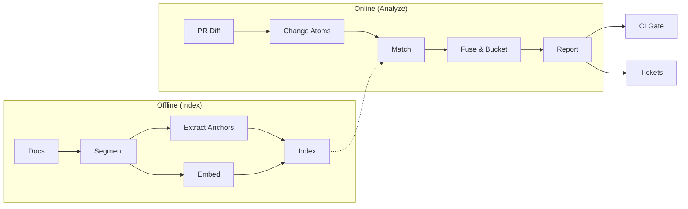

# DCIA: Documentation Change Impact Analysis

**One-Pager Summary**

---

## What It Does

Automatically detects which documentation sections need updating when code changes.



---

## How It Works



---

## The Two Channels

| Channel | Method | Strength | Example |
|---------|--------|----------|---------|
| **PUSH** (Percolation) | Exact anchor matching | High precision | `--dry-run` flag removed → finds all docs mentioning `--dry-run` |
| **PULL** (Retrieval) | BM25 + Vector search | High recall | "scheduler behavior changed" → finds docs about scheduling |

---

## Key Concepts

### 1. Doc Sections
Docs are split by headings. Each section has:
- **Anchors**: symbols, flags, config keys, endpoints, paths
- **Embedding**: for semantic search

### 2. Change Atoms
Diffs become small, doc-relevant claims:
```
"--dry-run flag removed from deploy command"
```

### 3. Score Fusion
Combines signals into one score:
```
S = explicit_match + anchor_overlap + lexical_score + semantic_score + co-change_history
```

---

## Output Buckets

| Bucket | Threshold | Action |
|--------|-----------|--------|
| **Must Update** | S >= 0.85 or explicit high-risk match | Block PR / Create ticket |
| **Review** | 0.55 <= S < 0.85 | Human review (optional LLM triage) |
| **Probably OK** | S < 0.55 | No action needed |

---

## End-to-End Flow



---

## Implementation Phases

| Phase | Deliverable |
|-------|-------------|
| **1. Fast Value** | Doc segmentation, rule-based atoms, BM25 retrieval, basic report |
| **2. Precision** | Explicit anchor matching, fusion scoring, CI integration |
| **3. Scale** | Co-change priors, bounded LLM triage, ownership routing |

---

## Key Design Principles

1. **Two channels** - Percolation for explicit, retrieval for implicit
2. **LLMs adjudicate, don't search** - Bounded to top-K candidates only
3. **Explainability** - Every flag shows matched anchors + diff hunks
4. **Doc sections** - Match how humans edit docs

---

*For full details, see [hybrid_dcia_architecture.md](./hybrid_dcia_architecture.md)*
