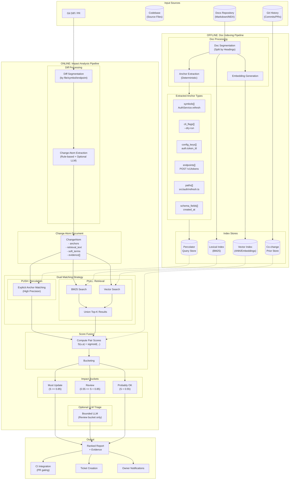

# Hybrid Documentation Change Impact Analysis (DCIA) — Architecture

**Status:** Draft (reference implementation guide)  
**Audience:** Docs tooling / developer productivity / platform engineering  
**Goal:** Detect which doc sections are likely stale after code changes, with high precision on explicit references and high recall on implicit references.

---

## 1. Problem statement

You have:
- A set of documentation articles (often with **explicit** references to code: symbols, flags, config keys, endpoints, file paths; and **implicit** references: “the token refresh flow”, “the scheduler semantics”, etc.)
- A codebase that has changed since docs were last updated
- A full git diff (and optionally git history)

You want:
- A ranked, explainable list of **doc sections to update**
- Evidence for why each section is flagged
- Optional CI integration (fail builds, create tickets, notify owners)

---

## 2. Design principles

1. **Two channels, two strengths**
   - **Percolation (push)** for **explicit anchors** ⇒ high precision, deterministic evidence.
   - **Retrieval (pull)** for **implicit coupling** ⇒ higher recall via lexical + semantic similarity.
2. **Atomic change units**
   - Convert diffs/commits into **Change Atoms**: small, doc-relevant statements (flag removed, config default changed, API signature changed).
3. **Doc sections as the unit of update**
   - Chunk docs at heading-level sections to match how humans edit docs and how references cluster.
4. **Explainability is a feature**
   - Every flagged section should show: which anchor matched / which diff hunk / which artifact, and the score breakdown.
5. **LLMs adjudicate; they don’t search**
   - LLMs should only triage/refine decisions **within a bounded candidate set** (top-K retrieval results + explicit matches). No free-form “go find things”.

---

## 3. High-level architecture

```mermaid
flowchart LR
  subgraph Offline[Indexing / Batch]
    D[Docs Repo] --> S1[Doc Segmentation\n(heading sections)]
    S1 --> A1[Anchor Extraction\nsymbols/flags/keys/endpoints/paths]
    S1 --> E1[Embedding Generation\n(section text + code blocks)]
    A1 --> PQ[Percolator Query Builder\n(deterministic)]
    S1 --> LEX[Lexical Index (BM25)]
    E1 --> VEC[Vector Index (ANN)]
    PQ --> PERCQ[Percolator Query Store]
    H[Git History (optional)] --> CO[Co-change Prior Builder]
    CO --> COIDX[Co-change Store]
  end

  subgraph Online[Impact Analysis / Runtime]
    DIFF[Git Diff / PR] --> S2[Diff Segmentation\n(by file+symbol/endpoint/key)]
    S2 --> CA[Change Atom Extractor\n(rule-based + optional LLM)]
    CA --> CDOC[Change Atom Document\n(anchors + retrieval_text)]
    CDOC --> PERC[Percolation Engine\n(explicit anchor matches)]
    CDOC --> RET[Retriever\nBM25 + embeddings]
    PERC --> FUSE[Score Fusion + Bucketing]
    RET --> FUSE
    COIDX --> FUSE
    FUSE --> TRIAGE[Optional LLM Triage\n(for ambiguous)]
    TRIAGE --> REPORT[Ranked Report\n+ evidence]
  end
```

### 3.1 Detailed flow diagram



### 3.2 Architecture summary

The system uses a **two-channel approach** to detect stale documentation:

**Offline Pipeline (Indexing)**
1. **Doc Segmentation** - Split docs into heading-level sections
2. **Anchor Extraction** - Extract explicit references (symbols, flags, config keys, endpoints, paths)
3. **Index Building** - Create BM25 (lexical), Vector (semantic), and Percolator query stores
4. **Co-change Priors** - Compute historical doc-code coupling from git history

**Online Pipeline (Analysis)**
1. **Diff Processing** - Segment diffs and extract Change Atoms
2. **Dual Matching**:
   - **Percolation (Push)** - High precision explicit anchor matching
   - **Retrieval (Pull)** - BM25 + vector search for implicit coupling
3. **Score Fusion** - Combine signals into a single score per doc section
4. **Bucketing** - Categorize into Must Update / Review / Probably OK
5. **Optional LLM Triage** - Adjudicate ambiguous cases (bounded, not searching)

**Outputs**
- Ranked report with evidence
- CI/PR gating
- Ticket creation
- Owner notifications

---

## 4. Core entities & schemas

### 4.1 DocSection (index unit)

**Recommended granularity:** one heading section.

**Fields**
- `doc_id`: stable id (`path#heading_hash`)
- `path`: `docs/auth.md`
- `heading_path`: `Authentication > Refresh Tokens`
- `title`: `Refresh Tokens`
- `body_text`: normalized text
- `code_blocks`: extracted fenced blocks
- `anchors`:
  - `symbols[]` (e.g., `AuthService.refreshToken`)
  - `paths[]` (e.g., `src/auth/refresh.ts`)
  - `cli_flags[]` (e.g., `--dry-run`)
  - `config_keys[]` (e.g., `auth.token_ttl`)
  - `endpoints[]` (e.g., `POST /v1/tokens/refresh`)
  - `schema_fields[]` (e.g., `created_at`)
  - `errors[]` (optional, user-facing)
- `embedding`: vector for semantic retrieval
- `owners[]`: optional (CODEOWNERS mapping)
- `last_updated`: optional metadata

### 4.2 ChangeAtom (analysis unit)

**Purpose:** smallest doc-relevant claim extracted from diffs.

**Fields**
- `atom_id`: stable id (`commit+segment+ordinal`)
- `change_kind`: `add|remove|rename|signature_change|default_change|behavior_change|output_change|schema_change|refactor|unknown`
- `public_surface`: `true|false|unknown`
- `surface_types[]`: `API|CLI|Config|Schema|Output|Behavior|Internal`
- `anchors` (same structure as DocSection; anchors should be literal tokens from diff)
- `retrieval_text`: 2–3 sentences **including anchors verbatim**, plus identifier-split tokens
- `soft_terms[]`: derived only from anchors (split/normalized); avoid LLM-invented synonyms
- `evidence[]`: list of `{path, hunk_header, notes}` pointing to diff hunks
- `risk`: `high|medium|low|unknown`

---

## 5. Pipeline A: Doc indexing (offline/batch)

### 5.1 Segmentation
- Split each doc into heading sections.
- Store `heading_path` and include heading text in the section body for retrieval.

### 5.2 Anchor extraction (deterministic)
Extract anchors from:
- inline code spans and fenced code blocks
- obvious patterns:
  - CLI flags: `--[a-z0-9-]+`
  - config keys: dotted paths `foo.bar_baz`
  - endpoints: `GET|POST|PUT|PATCH|DELETE /...`
  - symbols: language-aware heuristics, or code-font tokens with `.` / `::` / `()` / `#`
  - file paths: `src/...`, `pkg/...`, etc.

> Important: keep this **deterministic** to avoid query drift.

### 5.3 Indices to build
1. **Lexical (BM25)** over `title + heading_path + body_text + code_blocks`
2. **Vector (ANN)** over an embedding of the same fields
3. **Percolator query store**
   - One query per `DocSection`, mostly boolean matching on anchor fields:
     - `symbols` OR `cli_flags` OR `config_keys` OR `endpoints` OR `paths` OR `schema_fields`
   - Optionally include a weak fallback match on normalized tokens, but keep it conservative.

### 5.4 Optional: co-change prior store
From git history, compute signals like:
- `P(doc_path | code_path)` from commit co-occurrence
- graph/community clustering (docs and code in same subsystem)

Store as:
- `cochange_score(doc_section_id, code_path_prefix)` or
- `cochange_score(doc_section_id, module_id)`

---

## 6. Pipeline B: Change ingestion (runtime)

### 6.1 Diff segmentation (pre-LLM)
Group diff hunks into **segments** that are coherent:
- same file + same symbol (preferred, AST-based)
- same endpoint/flag/key token in hunk
- same OpenAPI path stanza / schema file
- fallback: per hunk for small diffs

### 6.2 Change atom extraction
**Recommended approach:**
- Rule-based extraction for common patterns (fast, consistent):
  - flag added/removed
  - config key changed/default changed
  - endpoint added/removed/renamed
  - function/class signature changes
  - user-facing strings changed (`--help`, error codes/messages)
- Optional LLM pass per segment to:
  - normalize into doc-relevant “atoms”
  - label change_kind
  - *strictly* cite evidence hunks

**LLM constraints**
- Output must be JSON (ChangeAtom schema).
- Use only provided diff/context. If uncertain, set unknown.

### 6.3 Change atom document for matching
For each atom produce a matchable “document”:
- structured anchor arrays
- `retrieval_text` (anchors verbatim + 1–2 sentences)
- `soft_terms` (identifier-splitting only)

---

## 7. Matching stage 1: Percolation for explicit anchors (push)

### 7.1 What percolation does
For each ChangeAtom document:
- Run against per-doc-section stored queries.
- Return list of `DocSection` matches with:
  - which anchor field matched (symbols/flags/keys/etc.)
  - which literal values matched

### 7.2 What it’s best at
- Exact references (high precision)
- Strong evidence for audits and CI gating

### 7.3 What it’s weak at
- Implicit references (“this section describes scheduler semantics”) unless you broaden queries too much.

> Keep percolation **anchor-driven**. Don’t let it become a synonym machine.

---

## 8. Matching stage 2: Retrieval for implicit coupling (pull)

### 8.1 Retrieval strategy
For each ChangeAtom:
1. **Lexical retrieval** (BM25) on `retrieval_text + anchors expanded + soft_terms`
2. **Vector retrieval** on embedding(`retrieval_text`)
3. Union top-K results (e.g., K=20–50 each), de-dup by `doc_section_id`

### 8.2 Boosters
- If any anchor overlaps between atom and doc section, boost (even if not percolated)
- Co-change prior boosts score if doc historically moves with affected code area
- Title match boost (heading contains key noun phrase from anchors)

### 8.3 Guardrails
- Require at least **one** of:
  - minimal lexical overlap with anchors/soft_terms, OR
  - co-change prior above threshold, OR
  - explicit anchor match
to avoid “semantic-only” noise.

---

## 9. Fusion, bucketing, and evidence

### 9.1 Pair scoring
For each `(DocSection u, ChangeAtom a)` candidate pair compute features:
- `f_exp`: explicit percolation hit (0/1)
- `f_anchor_overlap`: count / weighted overlap of anchors
- `f_bm25`: normalized BM25 score
- `f_sem`: cosine similarity
- `f_co`: co-change prior
- `f_kind_risk`: risk boost for `remove|rename|signature_change|default_change|schema_change`

Example fused score:
```
S(u,a) = sigmoid(
  w_exp*f_exp +
  w_anch*f_anchor_overlap +
  w_lex*f_bm25 +
  w_sem*f_sem +
  w_co*f_co +
  w_risk*f_kind_risk
)
```

Aggregate per doc section:
- `S(u) = max_a S(u,a)` and keep top-3 atoms as evidence.

### 9.2 Buckets (recommended defaults)
- **Must Update**
  - percolation hit on a high-risk anchor (flag removed, key renamed, endpoint changed), OR
  - `S(u) >= 0.85`
- **Review**
  - `0.55 <= S(u) < 0.85`
- **Probably OK**
  - `< 0.55`

### 9.3 Evidence payload
Each flagged doc section should display:
- matched anchors (exact strings)
- the ChangeAtom `title`, `change_kind`, `retrieval_text`
- diff hunk pointers (`path`, `@@ ... @@`)
- score breakdown (optional but valuable for tuning)

---

## 10. Optional LLM triage (bounded)

### When to run it
Only on **Review** bucket items where you want to reduce false positives.

### Inputs (strictly bounded)
- doc section text (title + body + code blocks)
- top-N matching change atoms (usually N ≤ 3)
- the exact diff hunks cited by those atoms

### Output
- `needs_update: yes/no/uncertain`
- `update_type` (rename, signature, behavior, example, output, etc.)
- `edit_suggestions`: bullet list, referencing anchors and evidence
- `confidence`

### Important
LLM **does not** discover new candidates; it only adjudicates and suggests edits.

---

## 11. Operational modes

### 11.1 CI / PR gating
- Run on each PR:
  - produce report artifact (markdown + JSON)
  - optionally fail if:
    - any `Must Update` doc section is owned by the repo and not modified in PR
    - or if a release label is present and docs drift is non-zero

### 11.2 Release gating
- Run on release branch diff vs last release tag:
  - produce a “docs impact” checklist
  - create tickets per doc owner team

### 11.3 Streaming notifications (optional)
- For monorepos with frequent changes:
  - percolation results can route to doc owners with low latency

---

## 12. Storage & technology choices (implementation-agnostic)

You can implement the hybrid architecture with many stacks:

- **Elasticsearch/OpenSearch**
  - percolator queries for DocSections
  - BM25 built-in
  - vector search (kNN) depending on version/plugin
- **Postgres**
  - full text search for lexical
  - `pgvector` for embeddings
  - “percolation” via inverted mappings (anchor → doc sections) rather than query-per-doc
- **Vector DB**
  - Pinecone/Milvus/Weaviate/etc. for semantic
  - separate anchor inverted index in Redis/Postgres for explicit matches

**Recommendation:** start with a simple, maintainable setup:
- Anchor inverted index (fast explicit matching)
- BM25 + embeddings retrieval
- Add true percolator queries only if you need complex boolean routing and stored-query management.

---

## 13. Quality, tuning, and evaluation

### 13.1 Ground truth
Create a small labeled dataset:
- sample ~50–200 doc sections across a few releases
- label which ones truly required updates based on human review

### 13.2 Metrics
- Precision/Recall by bucket:
  - Must Update should aim for very high precision
  - Review aims for high recall
- Time-to-triage
- “Docs drift escapes” (bugs found post-release due to stale docs)

### 13.3 Tuning levers
- thresholds (`T_high`, `T_low`)
- weights for fused scoring
- top-K retrieval sizes
- anchor extraction patterns
- co-change prior strength

---

## 14. Failure modes & mitigations

1. **Too many false positives (review fatigue)**
   - tighten semantic-only guardrails
   - require minimal lexical overlap OR co-change prior
   - lower K for semantic retrieval
2. **Missed implicit references**
   - improve ChangeAtom `retrieval_text` from diff-adjacent comments/docstrings
   - increase semantic K
   - incorporate commit message as a weak feature (not as truth)
3. **Anchor drift / renames**
   - detect renames in ChangeAtom extraction; include both old+new anchors when available
4. **LLM hallucinations**
   - require evidence pointers
   - reject atoms lacking anchors/evidence
   - keep LLM bounded to candidate set

---

## 15. Minimal implementation plan (phased)

**Phase 1 (fast value)**
- Doc segmentation + anchor extraction
- ChangeAtom extraction (rule-based)
- Retrieval (BM25 + optional embeddings)
- Basic report

**Phase 2 (precision)**
- Explicit anchor matching (inverted index or percolation)
- Fusion + bucketing + evidence payload
- CI integration

**Phase 3 (scale & trust)**
- Co-change prior
- Optional bounded LLM triage
- Ownership routing + ticket creation

---

## 16. Appendix: Example artifacts

### Example ChangeAtom retrieval_text
> `--dry-run` flag was removed from `deploy`. Use `--plan` instead. Affects CLI help output and documentation referencing `--dry-run`.

### Example percolator query (conceptual)
- Match if any of:
  - `cli_flags` contains `--dry-run`
  - `symbols` contains `DeployCommand.run`
  - `config_keys` contains `deploy.dry_run`

---

**End of document.**
