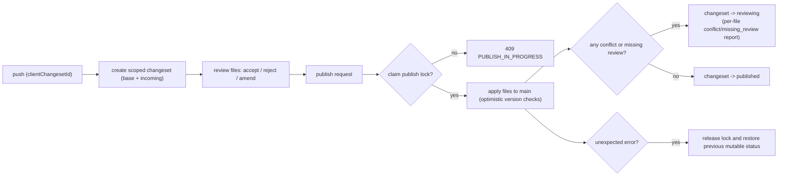

# Changeset Architecture

Jolli sync is a git-light, single-branch (`main`) workflow:

- `push` does not write directly to live docs. It creates a scoped changeset snapshot (`base` + `incoming`).
- Review decisions (`accept` / `reject` / `amend`) are stored per file.
- `publish` is the merge/apply step into `main`.
- Publish is single-writer: one request atomically claims `publishing`; concurrent publish attempts return `409 PUBLISH_IN_PROGRESS`.
- File writes still use optimistic version checks, so conflicts are surfaced per file and the changeset returns to `reviewing` when needed.

## Module Pointers

- `backend/src/router/SyncRouter.ts`: Primary sync API (`push`, `pull`, review, publish) and publish lock/state transition logic.
- `backend/src/dao/SyncCommitDao.ts`: Changeset persistence/read APIs and conditional status updates (`expectedCurrentStatuses`).
- `backend/src/model/SyncCommit.ts`: Changeset status model (`proposed/reviewing/ready/rejected/publishing/published/superseded`).
- `backend/src/model/SyncCommitFile.ts`: Per-file snapshot rows (base/incoming payload for publish-time checks).
- `backend/src/dao/SyncArticleDao.ts`: Cursor advancement/read model for sync timeline updates.
- `common/src/core/SyncChangesetClient.ts`: Typed client contract used by UI/clients for changeset APIs.
- `cli/src/client/commands/sync.ts`: CLI transport calls into `/v1/sync/*` endpoints.

## Flow Chart

This flowchart shows the operational path from `push` to `publish`: create a scoped changeset, collect per-file review decisions, then run a lock-guarded publish that either lands in `published` or returns to review with conflict details.



## State Machine

This state machine shows the durable status lifecycle for a changeset. Review transitions determine readiness, while publish moves through a transient `publishing` lock state so only one publish request can apply to `main` at a time.

```mermaid
stateDiagram-v2
    direction LR

    [*] --> Proposed: push

    Proposed --> Reviewing: review in progress
    Proposed --> Ready: all reviewed, any accept/amend
    Proposed --> Rejected: all reviewed, all reject

    Reviewing --> Ready: all reviewed, any accept/amend
    Reviewing --> Rejected: all reviewed, all reject
    Ready --> Reviewing: review changed
    Rejected --> Reviewing: review changed

    Proposed --> Publishing: publish (claim lock)
    Reviewing --> Publishing: publish (claim lock)
    Ready --> Publishing: publish (claim lock)
    Rejected --> Publishing: publish (claim lock)

    Publishing --> Published: no conflicts
    Publishing --> Reviewing: conflicts or missing review

    note right of Publishing
      concurrent publish => 409 PUBLISH_IN_PROGRESS
      unexpected error => lock released, status restored
    end note

    state Superseded
    note right of Superseded
      Reserved status (not currently active)
    end note
```

## Caveat

Publish is currently **per-file apply**, not all-or-nothing per changeset.  
If two different changesets are published concurrently and overlap on some files, non-overlapping files may still be applied while overlapping files return conflict and leave that changeset in `reviewing`.
