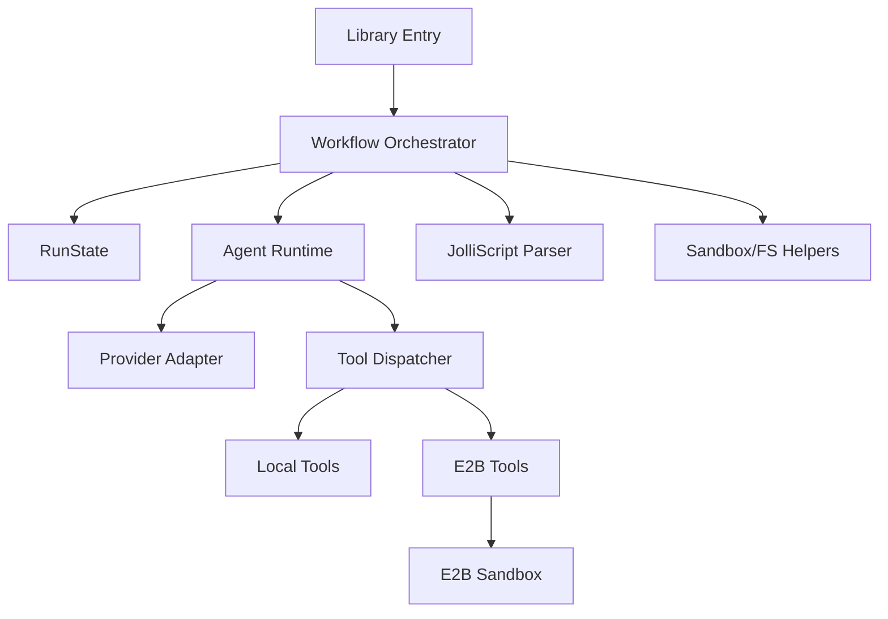

# JolliAgent Architecture

This document describes the architecture of the `tools/jolliagent` package, its core runtime, workflow
orchestration, and tooling layers.

## Overview

JolliAgent is a TypeScript-based agent framework that provides a provider-agnostic streaming agent
runtime, a tool execution layer (local or E2B sandbox), and higher-level workflows for documentation
generation and automation. It is designed as a library entry point for server-side workflows.

## Architecture Diagram

## Core Runtime

### Entry Points and Exports

- Public exports: `tools/jolliagent/src/index.ts`
- Package wiring: `tools/jolliagent/package.json`

### Agent Kernel

- Provider-agnostic streaming agent and tool loop: `tools/jolliagent/src/agents/Agent.ts`
- Shared message/tool/run-state types: `tools/jolliagent/src/Types.ts`

### Provider Adapter

- Anthropic client adapter for streaming and tool calls: `tools/jolliagent/src/providers/Anthropic.ts`

### Profiles and Factories

- Default model/tool settings: `tools/jolliagent/src/agents/profiles.ts`
- Agent factory and default-merging helper: `tools/jolliagent/src/agents/factory.ts`
- Specialized agents (architecture, docs, etc.): `tools/jolliagent/src/agents/*Agent.ts`

### Logging

- Unified logger interface: `tools/jolliagent/src/logger/Logger.ts`
- Console logger (stdout/stderr fallback): `tools/jolliagent/src/logger/CliLogger.ts`
- Server logger: `tools/jolliagent/src/logger/ServerLogger.ts`

## Workflow and Tooling Layer

### Tool Registry and Executors

- Tool registry and run dispatcher: `tools/jolliagent/src/tools/Tools.ts`
- Tool definitions + executor map: `tools/jolliagent/src/tools/tools/index.ts`
- Concrete tools (ls, cat, git, web, write, etc.): `tools/jolliagent/src/tools/tools/*.ts`

### Workflow Orchestration

- E2B sandbox lifecycle, pre-checkout, job steps, and sync hooks:
  `tools/jolliagent/src/workflows.ts`
- Direct API docs pipeline path: `tools/jolliagent/src/direct/workflows.ts`

### Sandbox and FS Helpers

- Local/E2B file listing and reading helpers: `tools/jolliagent/src/sandbox/utils.ts`

### JolliScript and Markdown Parsing

- JolliScript parsing/types: `tools/jolliagent/src/jolliscript/*`
- Section extraction for citations/meta: `tools/jolliagent/src/markdown/sections.ts`
- Workflow spec reference: `tools/jolliagent/docs/workflow.md`

## Execution Flow (Typical)

1. Backend or workflow entry point creates a `RunState`, loads env, and selects a specialized agent
   factory via `runWorkflowForJob` or direct agent creation.
2. In E2B mode, the workflow runner creates a sandbox and optionally pre-checks out a repo.
   (`tools/jolliagent/src/workflows.ts`)
3. The Agent streams from the provider and emits tool calls. Tool dispatch routes to local or E2B
   executors via `runToolCall`. (`tools/jolliagent/src/agents/Agent.ts`,
   `tools/jolliagent/src/tools/Tools.ts`)
4. Optional job steps (run, run_tool, run_prompt) execute before the main agent turn and can inject
   summaries into later prompts. (`tools/jolliagent/src/workflows.ts`)
5. Optional finalizers and sync hooks persist artifacts; sandbox cleanup runs at the end.
   (`tools/jolliagent/src/agents/finalizers.ts`, `tools/jolliagent/src/workflows.ts`)

## Key Components by Responsibility

- Agent runtime: `tools/jolliagent/src/agents/Agent.ts`
- Provider bridge: `tools/jolliagent/src/providers/Anthropic.ts`
- Tool registry and routing: `tools/jolliagent/src/tools/Tools.ts`
- Workflow runner: `tools/jolliagent/src/workflows.ts`

## Notes

- The workflow runner supports both agent-driven execution and direct pipelines (for API docs).
- The tool layer can switch between local and E2B execution based on `RunState.executorNamespace`.
- Backend integration details are documented in `tools/jolliagent/docs/architecture-web.md`.
