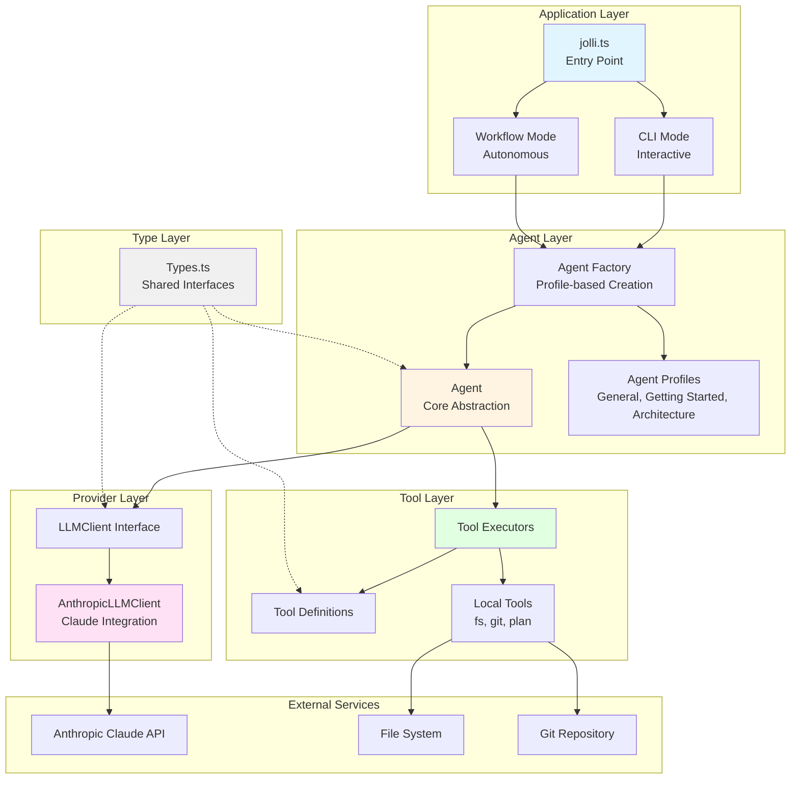
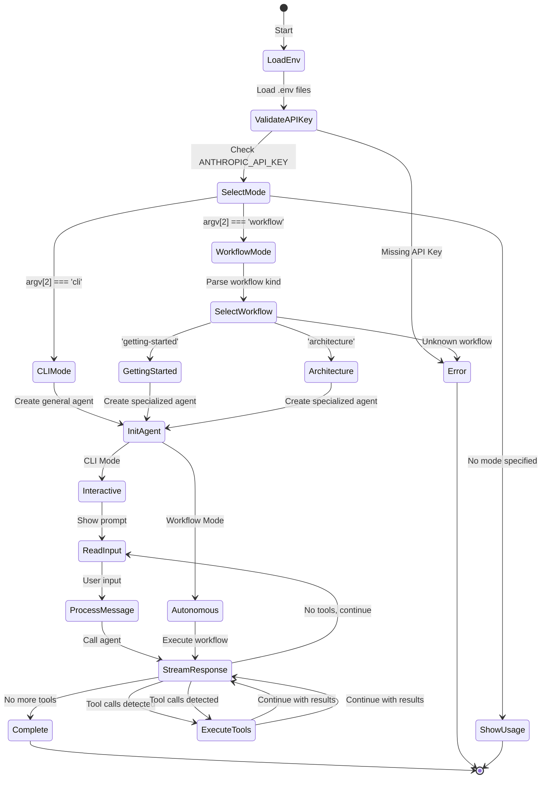
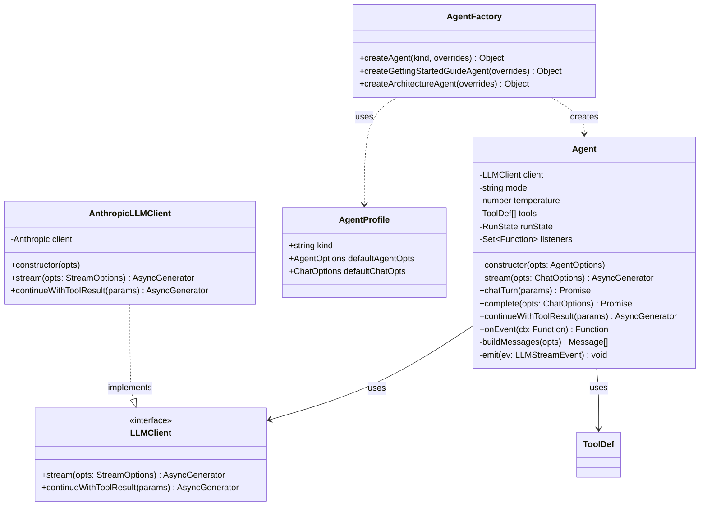
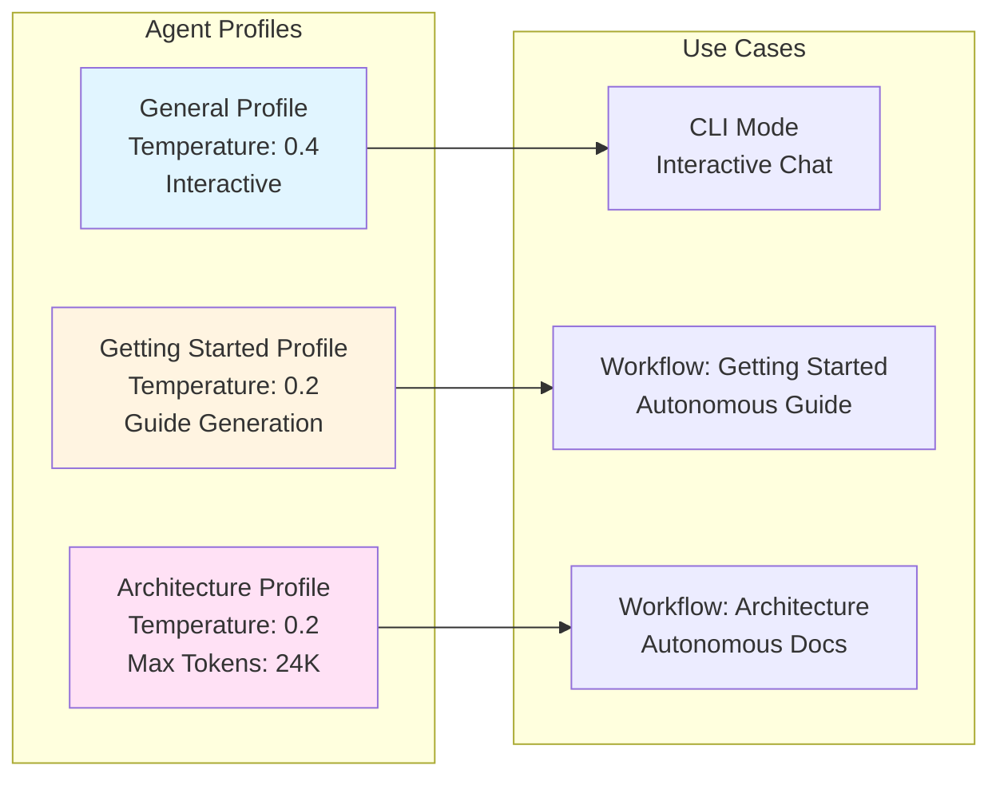
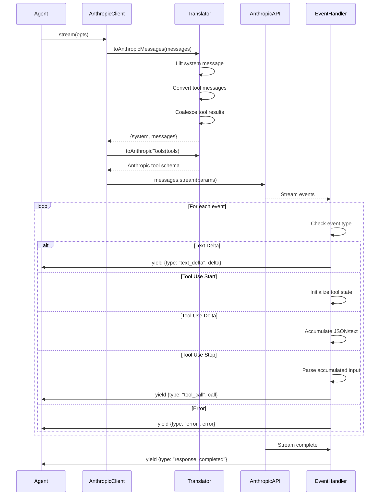
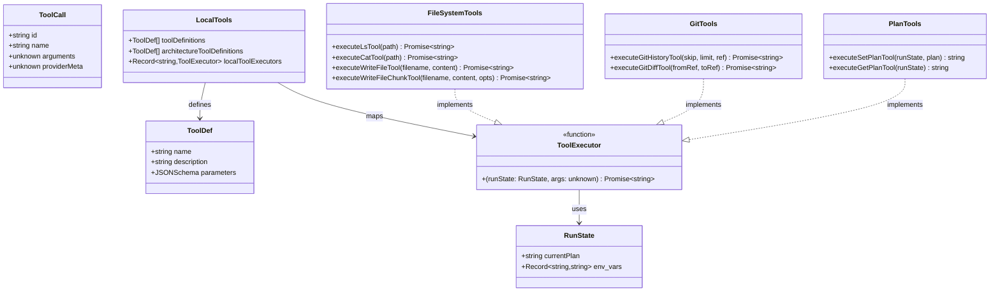
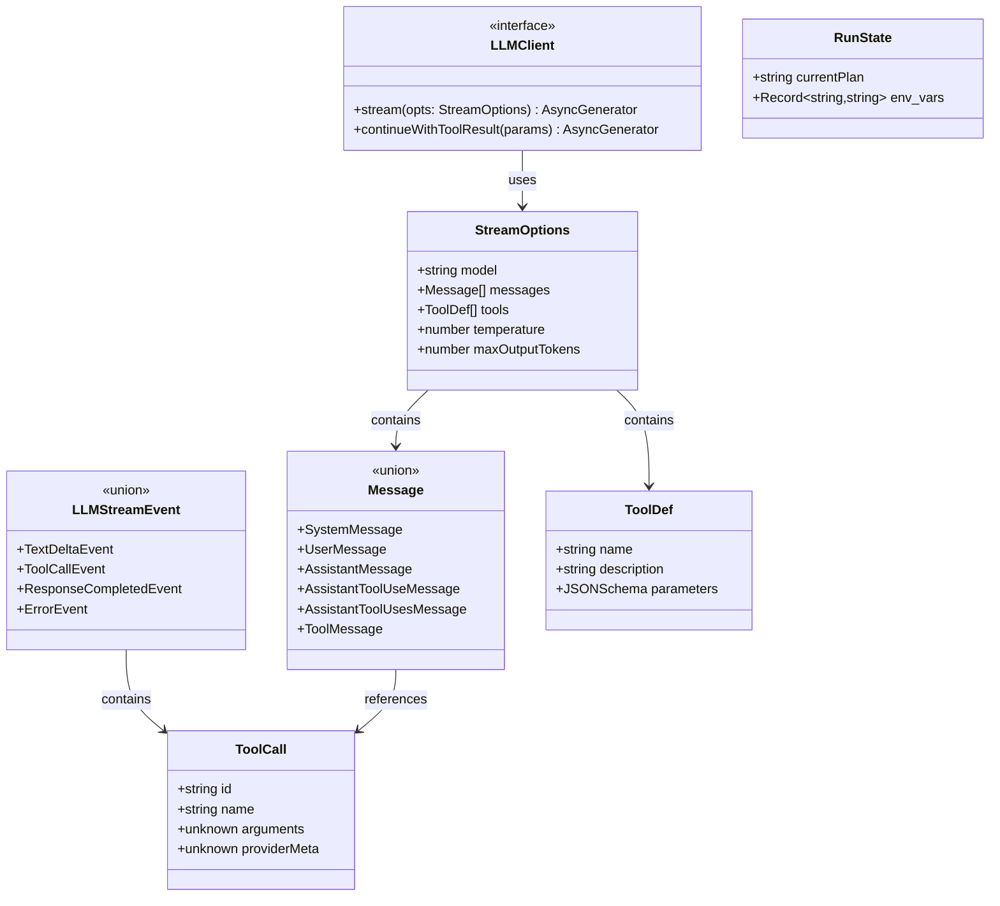
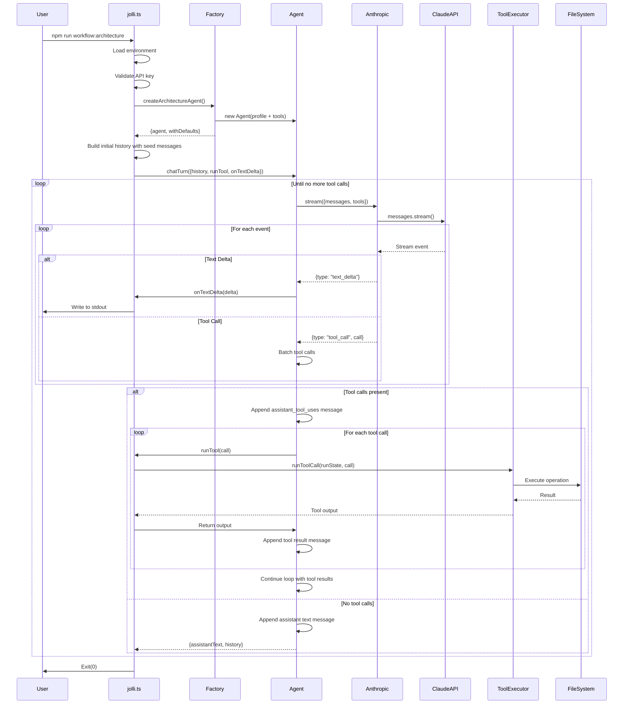
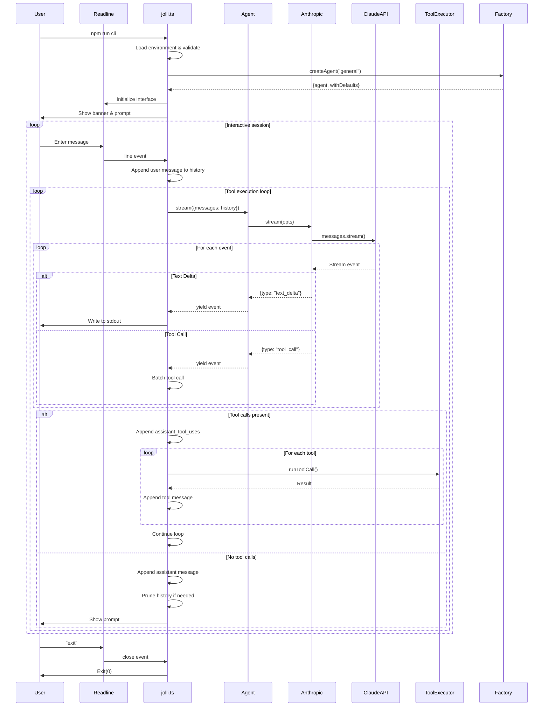

# JOLLI External CLI - Project Architecture

## Overview
<!-- meta: {"citations": [
   { "file": "package.json", "lines": "1-42", "description": "Project configuration, dependencies, and scripts" },
   { "file": "src/index.ts", "lines": "1-6", "description": "Main module exports" },
   { "file": "src/jolli.ts", "lines": "1-50", "description": "Application entry point and mode selection" }
] } -->

**JOLLI External CLI** is a TypeScript-based AI agent framework that provides an extensible command-line interface for interacting with Large Language Models (LLMs). The system supports both interactive CLI mode and autonomous workflow mode, with built-in tool execution capabilities for file system operations, git integration, and document generation.

The architecture is built around a provider-agnostic agent abstraction that can stream responses from various LLM providers (currently Anthropic Claude), execute tools autonomously, and maintain conversation state across multiple turns.

**Source References:**
- [`package.json:1-42`](./package.json#L1-L42) - Project configuration and dependencies
- [`src/index.ts:1-6`](./src/index.ts#L1-L6) - Main module exports
- [`src/jolli.ts:1-50`](./src/jolli.ts#L1-L50) - Application entry point

## Technology Stack
<!-- meta: {"citations": [
   { "file": "package.json", "lines": "27-42", "description": "Dependencies and devDependencies" },
   { "file": "tsconfig.json", "lines": "1-11", "description": "TypeScript configuration" }
] } -->

### Core Technologies
- **Runtime**: Node.js with TypeScript (ES Modules)
- **Language**: TypeScript 5.x with strict type checking
- **Build Tool**: Vite 7.1.9 for bundling
- **Test Framework**: Vitest 3.2.4 for unit and integration testing

### Key Dependencies
- **@anthropic-ai/sdk** (0.65.0) - Official Anthropic Claude API client
- **jolli-common** - Shared utilities and logging (monorepo package)
- **remark-parse** (11.0.0) - Markdown parsing
- **dotenv** (17.2.3) - Environment variable management

### Development Tools
- **tsx** (4.20.6) - TypeScript execution for development
- **unified** (11.0.5) - Text processing pipeline
- **yaml** (2.8.1) - YAML parsing for metadata
- **remark-frontmatter** (5.0.0) - Markdown frontmatter support

**Source References:**
- [`package.json:27-42`](./package.json#L27-L42) - Complete dependency list
- [`tsconfig.json:1-11`](./tsconfig.json#L1-L11) - TypeScript compiler configuration

## System Architecture
<!-- meta: {"citations": [
   { "file": "src/jolli.ts", "lines": "1-300", "description": "Main application orchestration and mode routing" },
   { "file": "src/agents/Agent.ts", "lines": "1-50", "description": "Core agent abstraction" },
   { "file": "src/providers/Anthropic.ts", "lines": "1-50", "description": "LLM provider implementation" }
] } -->

The system follows a layered architecture with clear separation of concerns:

1. **Application Layer** - Entry point, mode selection, and orchestration
2. **Agent Layer** - Provider-agnostic agent abstraction with streaming support
3. **Provider Layer** - LLM-specific implementations (Anthropic)
4. **Tool Layer** - Extensible tool execution framework
5. **Type Layer** - Shared type definitions and interfaces

**Source References:**
- [`src/jolli.ts:1-300`](./src/jolli.ts#L1-L300) - Application orchestration
- [`src/agents/Agent.ts:1-50`](./src/agents/Agent.ts#L1-L50) - Agent abstraction
- [`src/providers/Anthropic.ts:1-50`](./src/providers/Anthropic.ts#L1-L50) - Provider implementation

### High-Level Architecture Diagram




## Component Architecture

### Application Entry Point (jolli.ts)
<!-- meta: {"citations": [
   { "file": "src/jolli.ts", "lines": "1-50", "description": "Entry point, environment setup, and mode routing" },
   { "file": "src/jolli.ts", "lines": "51-100", "description": "Workflow mode implementation" },
   { "file": "src/jolli.ts", "lines": "150-250", "description": "CLI mode implementation with readline interface" }
] } -->

The main entry point orchestrates the application lifecycle, handles environment configuration, and routes execution to either CLI or Workflow mode based on command-line arguments.

**Key Responsibilities:**
- Environment variable loading from `.env` or `.env.local`
- API key validation
- Mode selection (CLI vs Workflow)
- Conversation history management with configurable pruning
- Tool call execution and result handling
- Streaming output to console

**Source References:**
- [`src/jolli.ts:1-50`](./src/jolli.ts#L1-L50) - Entry point and environment setup
- [`src/jolli.ts:51-100`](./src/jolli.ts#L51-L100) - Workflow mode implementation
- [`src/jolli.ts:150-250`](./src/jolli.ts#L150-L250) - CLI mode with readline



### Agent System
<!-- meta: {"citations": [
   { "file": "src/agents/Agent.ts", "lines": "1-50", "description": "Agent class definition and constructor" },
   { "file": "src/agents/Agent.ts", "lines": "51-100", "description": "Stream and chatTurn methods" },
   { "file": "src/agents/Agent.ts", "lines": "150-250", "description": "Message building and tool result filtering" },
   { "file": "src/agents/factory.ts", "lines": "1-100", "description": "Agent factory functions and profile-based creation" },
   { "file": "src/agents/profiles.ts", "lines": "1-60", "description": "Agent profile definitions" }
] } -->

The Agent system provides a provider-agnostic abstraction for interacting with LLMs, supporting streaming responses, tool execution, and conversation management.

**Key Components:**
- **Agent Class**: Core abstraction with streaming and tool handling
- **Agent Factory**: Profile-based agent creation with defaults
- **Agent Profiles**: Predefined configurations for different use cases

**Features:**
- Provider-agnostic streaming interface
- Automatic tool call batching and execution
- Conversation history management
- Error handling with retry logic
- Event subscription system

**Source References:**
- [`src/agents/Agent.ts:1-50`](./src/agents/Agent.ts#L1-L50) - Agent class definition
- [`src/agents/Agent.ts:51-100`](./src/agents/Agent.ts#L51-L100) - Stream and chatTurn methods
- [`src/agents/Agent.ts:150-250`](./src/agents/Agent.ts#L150-L250) - Message processing
- [`src/agents/factory.ts:1-100`](./src/agents/factory.ts#L1-L100) - Factory functions
- [`src/agents/profiles.ts:1-60`](./src/agents/profiles.ts#L1-L60) - Profile definitions



### Agent Profiles
<!-- meta: {"citations": [
   { "file": "src/agents/profiles.ts", "lines": "1-30", "description": "Profile interface and GeneralProfile" },
   { "file": "src/agents/profiles.ts", "lines": "31-60", "description": "GettingStartedProfile definition" },
   { "file": "src/agents/factory.ts", "lines": "50-100", "description": "Specialized agent factories" }
] } -->

Agent profiles provide predefined configurations for different use cases:

**General Profile**:
- Model: claude-sonnet-4-5-20250929
- Temperature: 0.4 (balanced creativity)
- System: "You are a precise, helpful, minimal assistant."
- Tools: Full tool set

**Getting Started Profile**:
- Model: claude-sonnet-4-5-20250929
- Temperature: 0.2 (more deterministic)
- System: Guide generator with clarifying questions
- Tools: Full tool set
- Seed messages: Autonomous guide generation instructions

**Architecture Profile**:
- Model: claude-sonnet-4-5-20250929
- Temperature: 0.2 (deterministic)
- Max Output Tokens: 24,000 (large documents)
- System: Expert software architect
- Tools: Extended set with write_file_chunk
- Seed messages: Comprehensive architecture documentation instructions

**Source References:**
- [`src/agents/profiles.ts:1-30`](./src/agents/profiles.ts#L1-L30) - Profile interface and GeneralProfile
- [`src/agents/profiles.ts:31-60`](./src/agents/profiles.ts#L31-L60) - GettingStartedProfile
- [`src/agents/factory.ts:50-100`](./src/agents/factory.ts#L50-L100) - Specialized factories




### Provider Layer (Anthropic)
<!-- meta: {"citations": [
   { "file": "src/providers/Anthropic.ts", "lines": "1-50", "description": "Message translation and tool conversion" },
   { "file": "src/providers/Anthropic.ts", "lines": "51-150", "description": "AnthropicLLMClient implementation and streaming" },
   { "file": "src/providers/Anthropic.ts", "lines": "151-250", "description": "Tool use event handling and state management" }
] } -->

The Provider Layer implements the LLMClient interface for Anthropic's Claude API, handling message translation, streaming, and tool use coordination.

**Key Responsibilities:**
- Translate provider-agnostic messages to Anthropic format
- Handle streaming responses with text and tool use events
- Manage tool use state across content blocks
- Convert tool definitions to Anthropic schema
- Error handling and retry logic

**Message Translation Strategy:**
- Lift first `system` message to Anthropic's separate `system` parameter
- Convert `assistant_tool_use` and `assistant_tool_uses` to Anthropic `tool_use` blocks
- Coalesce consecutive `tool` messages into single user message with multiple `tool_result` blocks
- Preserve message ordering and adjacency requirements

**Source References:**
- [`src/providers/Anthropic.ts:1-50`](./src/providers/Anthropic.ts#L1-L50) - Message translation functions
- [`src/providers/Anthropic.ts:51-150`](./src/providers/Anthropic.ts#L51-L150) - Client implementation
- [`src/providers/Anthropic.ts:151-250`](./src/providers/Anthropic.ts#L151-L250) - Tool use handling



### Tool System
<!-- meta: {"citations": [
   { "file": "src/tools/LocalTools.ts", "lines": "1-100", "description": "Tool definitions and executors" },
   { "file": "src/tools/LocalTools.ts", "lines": "101-200", "description": "File system tools (ls, cat, write_file)" },
   { "file": "src/tools/LocalTools.ts", "lines": "201-300", "description": "Git tools (git_history, git_diff)" },
   { "file": "src/tools/LocalTools.ts", "lines": "301-400", "description": "Plan management and chunk writer" },
   { "file": "src/tools/Tools.ts", "lines": "1-50", "description": "Tool execution orchestration" }
] } -->

The Tool System provides an extensible framework for executing local operations, with built-in support for file system, git, and plan management.

**Available Tools:**

1. **Plan Management**
   - `set_plan`: Create/update task checklist
   - `get_plan`: Retrieve current plan

2. **File System**
   - `ls`: List directory contents
   - `cat`: Read file contents
   - `write_file`: Write complete file
   - `write_file_chunk`: Write/append file chunks (architecture workflow only)

3. **Git Integration**
   - `git_history`: Browse commit history with pagination
   - `git_diff`: Show diffs between commits or working directory


**Tool Execution Flow:**
1. Agent receives tool call from LLM
2. Tool executor validates and parses arguments
3. Executor runs tool with RunState context
4. Result returned as string to agent
5. Agent appends tool result to conversation history

**Source References:**
- [`src/tools/LocalTools.ts:1-100`](./src/tools/LocalTools.ts#L1-L100) - Tool definitions
- [`src/tools/LocalTools.ts:101-200`](./src/tools/LocalTools.ts#L101-L200) - File system tools
- [`src/tools/LocalTools.ts:201-300`](./src/tools/LocalTools.ts#L201-L300) - Git tools
- [`src/tools/LocalTools.ts:301-400`](./src/tools/LocalTools.ts#L301-L400) - Plan and chunk writer
- [`src/tools/Tools.ts:1-50`](./src/tools/Tools.ts#L1-L50) - Execution orchestration




### Type System
<!-- meta: {"citations": [
   { "file": "src/Types.ts", "lines": "1-50", "description": "Core type definitions for LLM streaming" },
   { "file": "src/Types.ts", "lines": "51-100", "description": "Message and tool type definitions" },
   { "file": "src/Types.ts", "lines": "101-130", "description": "RunState and shared interfaces" }
] } -->

The Type System provides comprehensive TypeScript definitions for all components, ensuring type safety across the application.

**Core Type Categories:**

1. **LLM Stream Types**
   - `LLMStreamEvent`: Union of text, tool call, completion, and error events
   - `MessageStream`: Async iterable with finalMessage method
   - `StreamOptions`: Configuration for streaming requests

2. **Message Types**
   - `Message`: Union type supporting system, user, assistant, tool, and tool use messages
   - Provider-agnostic message format with role-based discrimination

3. **Tool Types**
   - `ToolDef`: Tool definition with JSON schema parameters
   - `ToolCall`: Tool invocation with arguments and metadata
   - `JSONSchema`: Flexible schema definition

4. **Client Interface**
   - `LLMClient`: Provider-agnostic interface for streaming and tool continuation

5. **State Types**
   - `RunState`: Shared state for tool execution (plan, env vars)

**Source References:**
- [`src/Types.ts:1-50`](./src/Types.ts#L1-L50) - LLM streaming types
- [`src/Types.ts:51-100`](./src/Types.ts#L51-L100) - Message and tool types
- [`src/Types.ts:101-130`](./src/Types.ts#L101-L130) - RunState and shared interfaces



## Data Flow

**Source References:**
- [`src/jolli.ts:100-200`](./src/jolli.ts#L100-L200) - Workflow mode data flow
- [`src/jolli.ts:200-300`](./src/jolli.ts#L200-L300) - CLI mode data flow
- [`src/agents/Agent.ts:51-150`](./src/agents/Agent.ts#L51-L150) - Agent chatTurn flow
- [`src/providers/Anthropic.ts:51-250`](./src/providers/Anthropic.ts#L51-L250) - Provider streaming flow

### Workflow Mode Data Flow



### CLI Mode Data Flow




## Directory Structure
<!-- meta: {"citations": [
   { "file": "package.json", "lines": "1-10", "description": "Project root configuration" }
] } -->

```
jolli-external-cli/
├── src/                          # Source code
│   ├── agents/                   # Agent system
│   │   ├── Agent.ts             # Core agent abstraction
│   │   ├── factory.ts           # Agent factory functions
│   │   └── profiles.ts          # Agent profile definitions
│   ├── providers/               # LLM provider implementations
│   │   └── Anthropic.ts         # Anthropic Claude integration
│   ├── tools/                   # Tool system
│   │   ├── LocalTools.ts        # Tool definitions and executors
│   │   └── Tools.ts             # Tool orchestration
│   ├── config/                  # Configuration
│   │   └── llm.ts              # LLM configuration helpers
│   ├── Types.ts                # Shared type definitions
│   ├── index.ts                # Public API exports
│   ├── jolli.ts                # Application entry point
│   └── jolli-banner.txt        # CLI banner text
├── tests/                       # Test suites
│   ├── unit/                   # Unit tests
│   ├── integration/            # Integration tests
│   └── resource/               # Test resources
├── dist/                        # Build output (generated)
├── logs/                        # Application logs
├── .env.local                  # Local environment variables (gitignored)
├── package.json                # Project configuration
├── tsconfig.json               # TypeScript configuration
├── vite.config.ts              # Vite build configuration
└── vitest.config.ts            # Vitest test configuration
```

**Key Directories:**

- **`src/agents/`**: Agent abstraction, factory, and profiles for different use cases
- **`src/providers/`**: LLM provider implementations (currently Anthropic)
- **`src/tools/`**: Extensible tool system with local executors
- **`src/config/`**: Configuration helpers and defaults
- **`tests/`**: Comprehensive test suite with unit and integration tests

**Source References:**
- [`package.json:1-10`](./package.json#L1-L10) - Project structure and scripts

## Key Design Patterns

### 1. Strategy Pattern (Provider Abstraction)
<!-- meta: {"citations": [
   { "file": "src/Types.ts", "lines": "30-50", "description": "LLMClient interface definition" },
   { "file": "src/providers/Anthropic.ts", "lines": "51-100", "description": "Anthropic implementation of LLMClient" },
   { "file": "src/agents/Agent.ts", "lines": "20-40", "description": "Agent using LLMClient interface" }
] } -->

The system uses the Strategy pattern to abstract LLM providers behind the `LLMClient` interface, allowing different providers to be swapped without changing agent code.

**Implementation:**
- `LLMClient` interface defines `stream()` and `continueWithToolResult()` methods
- `AnthropicLLMClient` implements the interface with Anthropic-specific logic
- `Agent` depends only on the interface, not concrete implementations

**Benefits:**
- Easy to add new providers (OpenAI, Google, etc.)
- Agent code remains provider-agnostic
- Testability through mock implementations

**Source References:**
- [`src/Types.ts:30-50`](./src/Types.ts#L30-L50) - LLMClient interface
- [`src/providers/Anthropic.ts:51-100`](./src/providers/Anthropic.ts#L51-L100) - Implementation
- [`src/agents/Agent.ts:20-40`](./src/agents/Agent.ts#L20-L40) - Usage in Agent

### 2. Factory Pattern (Agent Creation)
<!-- meta: {"citations": [
   { "file": "src/agents/factory.ts", "lines": "1-50", "description": "Agent factory functions" },
   { "file": "src/agents/profiles.ts", "lines": "1-60", "description": "Profile definitions" }
] } -->

The Factory pattern is used to create agents with predefined configurations based on profiles.

**Implementation:**
- `createAgent()`: General-purpose agent creation with profile selection
- `createGettingStartedGuideAgent()`: Specialized factory for guide generation
- `createArchitectureAgent()`: Specialized factory for architecture documentation
- Profiles encapsulate default options (model, temperature, tools, system prompt)

**Benefits:**
- Consistent agent configuration
- Easy to add new specialized agents
- Separation of configuration from usage

**Source References:**
- [`src/agents/factory.ts:1-50`](./src/agents/factory.ts#L1-L50) - Factory implementations
- [`src/agents/profiles.ts:1-60`](./src/agents/profiles.ts#L1-L60) - Profile definitions

### 3. Observer Pattern (Event Streaming)
<!-- meta: {"citations": [
   { "file": "src/agents/Agent.ts", "lines": "200-230", "description": "Event subscription system" },
   { "file": "src/jolli.ts", "lines": "100-150", "description": "Event consumption in workflow mode" }
] } -->

The Observer pattern enables reactive streaming of LLM events to multiple consumers.

**Implementation:**
- `Agent.onEvent()` registers event listeners
- `Agent.emit()` notifies all registered listeners
- Listeners receive `LLMStreamEvent` objects (text deltas, tool calls, errors)

**Benefits:**
- Decoupled event production and consumption
- Multiple consumers can observe the same stream
- Easy to add logging, metrics, or UI updates

**Source References:**
- [`src/agents/Agent.ts:200-230`](./src/agents/Agent.ts#L200-L230) - Event system
- [`src/jolli.ts:100-150`](./src/jolli.ts#L100-L150) - Event consumption

### 4. Command Pattern (Tool Execution)
<!-- meta: {"citations": [
   { "file": "src/tools/LocalTools.ts", "lines": "1-50", "description": "Tool definition structure" },
   { "file": "src/tools/LocalTools.ts", "lines": "400-450", "description": "Tool executor mapping" },
   { "file": "src/tools/Tools.ts", "lines": "1-50", "description": "Tool execution orchestration" }
] } -->

The Command pattern encapsulates tool operations as objects with standardized execution.

**Implementation:**
- `ToolDef` defines tool schema (name, description, parameters)
- `ToolExecutor` function type for execution logic
- `localToolExecutors` maps tool names to executor functions
- `runToolCall()` orchestrates execution with validation and error handling

**Benefits:**
- Extensible tool system
- Consistent error handling
- Easy to add new tools
- Testable in isolation

**Source References:**
- [`src/tools/LocalTools.ts:1-50`](./src/tools/LocalTools.ts#L1-L50) - Tool definitions
- [`src/tools/LocalTools.ts:400-450`](./src/tools/LocalTools.ts#L400-L450) - Executor mapping
- [`src/tools/Tools.ts:1-50`](./src/tools/Tools.ts#L1-L50) - Orchestration

### 5. Adapter Pattern (Message Translation)
<!-- meta: {"citations": [
   { "file": "src/providers/Anthropic.ts", "lines": "1-50", "description": "Message translation functions" }
] } -->

The Adapter pattern translates provider-agnostic messages to provider-specific formats.

**Implementation:**
- `toAnthropicMessages()` converts generic `Message[]` to Anthropic format
- Lifts system messages to separate parameter
- Converts tool use messages to Anthropic blocks
- Coalesces tool results into single messages

**Benefits:**
- Clean separation between generic and provider-specific formats
- Agent code uses simple, consistent message types
- Provider quirks isolated to adapter layer

**Source References:**
- [`src/providers/Anthropic.ts:1-50`](./src/providers/Anthropic.ts#L1-L50) - Translation functions

### 6. State Pattern (Conversation Management)
<!-- meta: {"citations": [
   { "file": "src/jolli.ts", "lines": "150-200", "description": "Conversation history management" },
   { "file": "src/agents/Agent.ts", "lines": "51-150", "description": "chatTurn state management" }
] } -->

The State pattern manages conversation state transitions through message history.

**Implementation:**
- Conversation history as array of `Message` objects
- State transitions via message appending
- History pruning to manage context window
- Tool execution loop maintains state consistency

**Benefits:**
- Clear state representation
- Easy to serialize/deserialize conversations
- Supports conversation replay and debugging

**Source References:**
- [`src/jolli.ts:150-200`](./src/jolli.ts#L150-L200) - History management
- [`src/agents/Agent.ts:51-150`](./src/agents/Agent.ts#L51-L150) - State transitions


## API/Interface Documentation

### LLMClient Interface
<!-- meta: {"citations": [
   { "file": "src/Types.ts", "lines": "30-50", "description": "LLMClient interface definition" }
] } -->

The core interface for LLM provider implementations.

```typescript
interface LLMClient {
  stream(opts: StreamOptions): AsyncGenerator<LLMStreamEvent, void, unknown>;
  continueWithToolResult(params: {
    model: string;
    priorMessages: Array<Message>;
    tool_call_id: string;
    tool_output: string;
    tool_name: string;
    temperature?: number;
  }): AsyncGenerator<LLMStreamEvent, void, unknown>;
}
```

**Methods:**
- `stream()`: Initiate a streaming request with messages and tools
- `continueWithToolResult()`: Continue conversation after tool execution

**Source References:**
- [`src/Types.ts:30-50`](./src/Types.ts#L30-L50) - Interface definition

### Agent Public API
<!-- meta: {"citations": [
   { "file": "src/agents/Agent.ts", "lines": "1-100", "description": "Agent class public methods" }
] } -->

The main agent interface for interacting with LLMs.

```typescript
class Agent {
  constructor(opts?: AgentOptions);
  
  // Streaming methods
  stream(opts: ChatOptions): AsyncGenerator<LLMStreamEvent, void, unknown>;
  continueWithToolResult(params: {...}): AsyncGenerator<LLMStreamEvent, void, unknown>;
  
  // High-level methods
  chatTurn(params: {
    history: Array<Message>;
    runTool: (call: ToolCall) => Promise<string>;
    onTextDelta?: (delta: string, isFirst: boolean) => void;
  }): Promise<{ assistantText: string; history: Array<Message> }>;
  
  complete(opts: ChatOptions): Promise<{
    text: string;
    usage?: { input_tokens?: number; output_tokens?: number; total_tokens?: number };
  }>;
  
  // Event subscription
  onEvent(cb: (ev: LLMStreamEvent) => void): () => void;
}
```

**Key Methods:**
- `stream()`: Low-level streaming with manual event handling
- `chatTurn()`: High-level autonomous turn with automatic tool execution
- `complete()`: Convenience method for non-streaming text completion
- `onEvent()`: Subscribe to stream events (returns unsubscribe function)

**Source References:**
- [`src/agents/Agent.ts:1-100`](./src/agents/Agent.ts#L1-L100) - Agent implementation

### Message Types
<!-- meta: {"citations": [
   { "file": "src/Types.ts", "lines": "70-100", "description": "Message type definitions" }
] } -->

Provider-agnostic message format supporting various roles.

```typescript
type Message =
  | { role: "system"; content: string }
  | { role: "user"; content: string }
  | { role: "assistant"; content: string }
  | { role: "assistant_tool_use"; tool_call_id: string; tool_name: string; tool_input: unknown }
  | { role: "assistant_tool_uses"; calls: Array<{...}> }
  | { role: "tool"; tool_call_id: string; content: string; tool_name: string };
```

**Message Roles:**
- `system`: System instructions (lifted to provider's system parameter)
- `user`: User input
- `assistant`: Assistant response text
- `assistant_tool_use`: Single tool invocation by assistant
- `assistant_tool_uses`: Batched tool invocations in one turn
- `tool`: Tool execution result

**Source References:**
- [`src/Types.ts:70-100`](./src/Types.ts#L70-L100) - Message definitions

### Tool Definition Schema
<!-- meta: {"citations": [
   { "file": "src/Types.ts", "lines": "100-120", "description": "Tool type definitions" },
   { "file": "src/tools/LocalTools.ts", "lines": "1-100", "description": "Example tool definitions" }
] } -->

Schema for defining tools that agents can execute.

```typescript
type ToolDef = {
  name: string;
  description?: string;
  parameters: JSONSchema;
};

type ToolCall = {
  id: string;
  name: string;
  arguments: unknown;
  providerMeta?: unknown;
};
```

**Example Tool Definition:**
```typescript
const ls_tool: ToolDef = {
  name: "ls",
  description: "List directory contents",
  parameters: {
    type: "object",
    properties: {
      path: {
        type: "string",
        description: "Optional path to list, defaults to current directory"
      }
    },
    required: []
  }
};
```

**Source References:**
- [`src/Types.ts:100-120`](./src/Types.ts#L100-L120) - Type definitions
- [`src/tools/LocalTools.ts:1-100`](./src/tools/LocalTools.ts#L1-L100) - Example definitions

### Stream Event Types
<!-- meta: {"citations": [
   { "file": "src/Types.ts", "lines": "50-70", "description": "Stream event type definitions" }
] } -->

Events emitted during LLM streaming.

```typescript
type LLMStreamEvent = 
  | TextDeltaEvent 
  | ToolCallEvent 
  | ResponseCompletedEvent 
  | ErrorEvent;

type TextDeltaEvent = {
  type: "text_delta";
  delta: string;
};

type ToolCallEvent = {
  type: "tool_call";
  call: ToolCall;
};

type ResponseCompletedEvent = {
  type: "response_completed";
  finish_reason: "stop" | "length" | "tool_calls" | "other";
  usage?: { input_tokens?: number; output_tokens?: number; total_tokens?: number };
};

type ErrorEvent = {
  type: "error";
  error: string;
  code?: string;
  providerMeta?: unknown;
};
```

**Event Types:**
- `text_delta`: Incremental text output from assistant
- `tool_call`: Assistant requesting tool execution
- `response_completed`: Stream finished with usage stats
- `error`: Provider or network error

**Source References:**
- [`src/Types.ts:50-70`](./src/Types.ts#L50-L70) - Event definitions

## Configuration and Environment

### Environment Variables
<!-- meta: {"citations": [
   { "file": "src/jolli.ts", "lines": "10-30", "description": "Environment loading logic" },
   { "file": "src/config/llm.ts", "lines": "1-20", "description": "Configuration helpers" }
] } -->

**Required:**
- `ANTHROPIC_API_KEY`: Anthropic API key for Claude access

**Optional:**
- `JOLLI_DEBUG`: Enable debug logging (any non-empty value)
- `JOLLI_MAX_OUTPUT_TOKENS`: Override default max output tokens (default: 8192)
- `GH_PAT`: GitHub Personal Access Token (for git operations requiring auth)

**Environment File Loading:**
The application searches for environment files in this order:
1. `<cwd>/.env.local`
2. `<cwd>/.env`
3. `<src_dir>/../.env.local`
4. `<src_dir>/../.env`

**Source References:**
- [`src/jolli.ts:10-30`](./src/jolli.ts#L10-L30) - Environment loading
- [`src/config/llm.ts:1-20`](./src/config/llm.ts#L1-L20) - Configuration helpers

### Build and Execution Scripts
<!-- meta: {"citations": [
   { "file": "package.json", "lines": "6-26", "description": "NPM scripts" }
] } -->

**Development:**
- `npm run cli` - Interactive CLI mode (development)
- `npm run workflow` - Workflow mode (development)
- `npm run workflow:getting-started` - Getting started guide workflow
- `npm run workflow:architecture` - Architecture documentation workflow

**Production:**
- `npm run build` - Build with Vite
- `npm run cli:build` - Build and run CLI
- `npm run workflow:build:getting-started` - Build and run getting started
- `npm run workflow:build:architecture` - Build and run architecture

**Testing:**
- `npm test` - Run all tests
- `npm run test:watch` - Watch mode
- `npm run test:integration` - Integration tests only

**Linting:**
- `npm run lint` - Check code quality
- `npm run lint:fix` - Auto-fix issues

**Source References:**
- [`package.json:6-26`](./package.json#L6-L26) - Script definitions

## Extension Points

### Adding a New LLM Provider
<!-- meta: {"citations": [
   { "file": "src/Types.ts", "lines": "30-50", "description": "LLMClient interface" },
   { "file": "src/providers/Anthropic.ts", "lines": "1-100", "description": "Reference implementation" }
] } -->

To add a new LLM provider:

1. **Implement LLMClient Interface:**
   ```typescript
   class OpenAILLMClient implements LLMClient {
     async *stream(opts: StreamOptions): AsyncGenerator<LLMStreamEvent> {
       // Translate messages to OpenAI format
       // Call OpenAI API
       // Yield LLMStreamEvent objects
     }
     
     async *continueWithToolResult(params) {
       // Handle tool result continuation
     }
   }
   ```

2. **Create Message Translator:**
   - Convert generic `Message[]` to provider format
   - Handle system messages appropriately
   - Map tool use messages to provider schema

3. **Update Agent Factory:**
   - Add provider option to factory functions
   - Allow provider selection via configuration

4. **Add Tests:**
   - Unit tests for message translation
   - Integration tests with provider API

**Source References:**
- [`src/Types.ts:30-50`](./src/Types.ts#L30-L50) - Interface to implement
- [`src/providers/Anthropic.ts:1-100`](./src/providers/Anthropic.ts#L1-L100) - Reference implementation

### Adding a New Tool
<!-- meta: {"citations": [
   { "file": "src/tools/LocalTools.ts", "lines": "1-100", "description": "Tool definition examples" },
   { "file": "src/tools/LocalTools.ts", "lines": "400-450", "description": "Tool executor registration" }
] } -->

To add a new tool:

1. **Define Tool Schema:**
   ```typescript
   const my_tool_def: ToolDef = {
     name: "my_tool",
     description: "Description of what the tool does",
     parameters: {
       type: "object",
       properties: {
         param1: { type: "string", description: "Parameter description" }
       },
       required: ["param1"]
     }
   };
   ```

2. **Implement Executor:**
   ```typescript
   async function executeMyTool(param1: string): Promise<string> {
     try {
       // Tool logic here
       return "Success message";
     } catch (error) {
       return `Error: ${error.message}`;
     }
   }
   ```

3. **Register Tool:**
   ```typescript
   export const toolDefinitions: Array<ToolDef> = [
     // ... existing tools
     my_tool_def
   ];
   
   export const localToolExecutors: Record<string, ToolExecutor> = {
     // ... existing executors
     my_tool: async (_runState, args) => await executeMyTool(args?.param1)
   };
   ```

4. **Add Tests:**
   - Unit tests for executor logic
   - Integration tests with agent

**Source References:**
- [`src/tools/LocalTools.ts:1-100`](./src/tools/LocalTools.ts#L1-L100) - Tool examples
- [`src/tools/LocalTools.ts:400-450`](./src/tools/LocalTools.ts#L400-L450) - Registration

### Adding a New Agent Profile
<!-- meta: {"citations": [
   { "file": "src/agents/profiles.ts", "lines": "1-60", "description": "Profile definitions" },
   { "file": "src/agents/factory.ts", "lines": "1-100", "description": "Factory functions" }
] } -->

To add a new agent profile:

1. **Define Profile:**
   ```typescript
   export const MyCustomProfile: AgentProfile = {
     kind: "my-custom",
     defaultAgentOpts: {
       model: "claude-sonnet-4-5-20250929",
       temperature: 0.3,
       tools: toolDefinitions,
       maxOutputTokens: 16000
     },
     defaultChatOpts: {
       system: "You are a specialized assistant for...",
       seedMessages: [
         { role: "user", content: "Initial instruction..." }
       ]
     }
   };
   ```

2. **Add to Profiles Map:**
   ```typescript
   export const profiles = {
     general: GeneralProfile,
     "getting-started": GettingStartedProfile,
     "my-custom": MyCustomProfile
   };
   ```

3. **Create Factory Function (Optional):**
   ```typescript
   export function createMyCustomAgent(overrides?: AgentOptions) {
     const profile = MyCustomProfile;
     const agent = new Agent({
       ...profile.defaultAgentOpts,
       ...overrides,
       client: overrides?.client ?? new AnthropicLLMClient()
     });
     
     const withDefaults = (opts: ChatOptions): ChatOptions => {
       return {
         ...opts,
         system: opts.system ?? profile.defaultChatOpts?.system,
         messages: opts.messages ?? profile.defaultChatOpts?.seedMessages
       };
     };
     
     return { agent, withDefaults };
   }
   ```

4. **Update Entry Point:**
   - Add workflow mode support in `jolli.ts`
   - Add npm script in `package.json`

**Source References:**
- [`src/agents/profiles.ts:1-60`](./src/agents/profiles.ts#L1-L60) - Profile structure
- [`src/agents/factory.ts:1-100`](./src/agents/factory.ts#L1-L100) - Factory pattern

## Testing Strategy

### Unit Tests
<!-- meta: {"citations": [
   { "file": "package.json", "lines": "8-10", "description": "Test scripts" }
] } -->

Unit tests focus on individual components in isolation:

- **Agent Tests**: Message building, event emission, history management
- **Provider Tests**: Message translation, tool conversion, event parsing
- **Tool Tests**: Individual tool executors with mocked file system
- **Type Tests**: Type safety and interface compliance

**Location:** `tests/unit/`

### Integration Tests
<!-- meta: {"citations": [
   { "file": "package.json", "lines": "10", "description": "Integration test script" }
] } -->

Integration tests verify end-to-end flows:

- **Provider Integration**: Real API calls to Anthropic (with test key)
- **Tool Integration**: Full tool execution with real file system
- **Workflow Integration**: Complete workflow runs with assertions

**Location:** `tests/integration/`

**Source References:**
- [`package.json:8-10`](./package.json#L8-L10) - Test configuration

## Performance Considerations

### Token Budget Management
<!-- meta: {"citations": [
   { "file": "src/config/llm.ts", "lines": "1-20", "description": "Max output token configuration" },
   { "file": "src/jolli.ts", "lines": "15-20", "description": "History pruning configuration" }
] } -->

**Max Output Tokens:**
- Default: 8,192 tokens per response
- Configurable via `JOLLI_MAX_OUTPUT_TOKENS` environment variable
- Architecture workflow: 24,000 tokens for large documents

**History Pruning:**
- Default: Unlimited history (`MAX_HISTORY = Infinity`)
- Configurable per mode
- Preserves system message when pruning
- Prevents context window overflow

**Source References:**
- [`src/config/llm.ts:1-20`](./src/config/llm.ts#L1-L20) - Token configuration
- [`src/jolli.ts:15-20`](./src/jolli.ts#L15-L20) - History management

### Streaming Optimization
<!-- meta: {"citations": [
   { "file": "src/providers/Anthropic.ts", "lines": "100-200", "description": "Streaming implementation" }
] } -->

**Strategies:**
- Incremental text output via `process.stdout.write()`
- Tool use state buffering to minimize memory
- Async generators for backpressure handling
- Event-driven architecture for non-blocking I/O

**Source References:**
- [`src/providers/Anthropic.ts:100-200`](./src/providers/Anthropic.ts#L100-L200) - Streaming implementation

## Security Considerations

### API Key Management
<!-- meta: {"citations": [
   { "file": "src/jolli.ts", "lines": "20-30", "description": "Environment loading and validation" }
] } -->

**Best Practices:**
- Store API keys in `.env.local` (gitignored)
- Validate presence before making API calls
- Never commit keys to version control
- Use environment-specific keys (dev/prod)

**Source References:**
- [`src/jolli.ts:20-30`](./src/jolli.ts#L20-L30) - Key validation

### Tool Execution Safety
<!-- meta: {"citations": [
   { "file": "src/tools/LocalTools.ts", "lines": "100-200", "description": "Tool validation and error handling" }
] } -->

**Safeguards:**
- Input validation for all tool parameters
- Error handling with descriptive messages
- No shell injection vulnerabilities (uses Node.js APIs)
- File system operations limited to current working directory context

**Source References:**
- [`src/tools/LocalTools.ts:100-200`](./src/tools/LocalTools.ts#L100-L200) - Tool safety

## Future Enhancements

### Planned Features
1. **Multi-Provider Support**: OpenAI, Google Gemini, local models
2. **Persistent Conversations**: Save/load conversation history
3. **Advanced Tool System**: Remote tools, tool composition, conditional execution
4. **Web UI**: Browser-based interface for CLI mode
5. **Streaming to Files**: Direct streaming output to files for large generations
6. **Plugin System**: Dynamic tool loading from external packages
7. **Conversation Branching**: Support for multiple conversation threads
8. **Token Usage Tracking**: Detailed analytics and cost estimation

### Architecture Evolution
- **Microservices**: Split into API server + worker processes
- **Database Integration**: Store conversations, documents, and analytics
- **Real-time Collaboration**: Multi-user sessions with WebSocket
- **Cloud Deployment**: Containerized deployment with Kubernetes

---

## Conclusion

JOLLI External CLI provides a robust, extensible foundation for building AI agent applications. The architecture emphasizes:

- **Provider Agnosticism**: Easy to add new LLM providers
- **Type Safety**: Comprehensive TypeScript types throughout
- **Extensibility**: Plugin-style tool system and agent profiles
- **Streaming Performance**: Efficient async streaming with backpressure
- **Developer Experience**: Clear separation of concerns and well-documented APIs

The system is production-ready for CLI and workflow automation use cases, with clear paths for extending to web applications, multi-user scenarios, and enterprise deployments.

**Complete Source References:**
- [`package.json`](./package.json) - Project configuration
- [`src/index.ts`](./src/index.ts) - Public API
- [`src/jolli.ts`](./src/jolli.ts) - Application entry point
- [`src/agents/Agent.ts`](./src/agents/Agent.ts) - Core agent
- [`src/agents/factory.ts`](./src/agents/factory.ts) - Agent factories
- [`src/agents/profiles.ts`](./src/agents/profiles.ts) - Agent profiles
- [`src/providers/Anthropic.ts`](./src/providers/Anthropic.ts) - Anthropic provider
- [`src/tools/LocalTools.ts`](./src/tools/LocalTools.ts) - Tool system
- [`src/tools/Tools.ts`](./src/tools/Tools.ts) - Tool orchestration
- [`src/Types.ts`](./src/Types.ts) - Type definitions
- [`src/config/llm.ts`](./src/config/llm.ts) - Configuration
