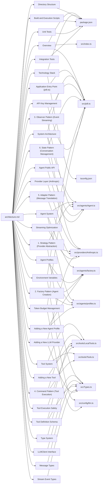

```mermaid
flowchart LR
    DOC["architecture.md"]
    S1["Overview"]
    S2["Technology Stack"]
    S3["System Architecture"]
    S4["Application Entry Point (jolli.ts)"]
    S5["Agent System"]
    S6["Agent Profiles"]
    S7["Provider Layer (Anthropic)"]
    S8["Tool System"]
    S9["Type System"]
    S10["Directory Structure"]
    S11["1. Strategy Pattern (Provider Abstraction)"]
    S12["2. Factory Pattern (Agent Creation)"]
    S13["3. Observer Pattern (Event Streaming)"]
    S14["4. Command Pattern (Tool Execution)"]
    S15["5. Adapter Pattern (Message Translation)"]
    S16["6. State Pattern (Conversation Management)"]
    S17["LLMClient Interface"]
    S18["Agent Public API"]
    S19["Message Types"]
    S20["Tool Definition Schema"]
    S21["Stream Event Types"]
    S22["Environment Variables"]
    S23["Build and Execution Scripts"]
    S24["Adding a New LLM Provider"]
    S25["Adding a New Tool"]
    S26["Adding a New Agent Profile"]
    S27["Unit Tests"]
    S28["Integration Tests"]
    S29["Token Budget Management"]
    S30["Streaming Optimization"]
    S31["API Key Management"]
    S32["Tool Execution Safety"]
    
    CF_packagejson["package.json"]
    CF_srcindexts["src/index.ts"]
    CF_srcjollits["src/jolli.ts"]
    CF_tsconfigjson["tsconfig.json"]
    CF_srcagentsAgentts["src/agents/Agent.ts"]
    CF_srcprovidersAnthropicts["src/providers/Anthropic.ts"]
    CF_srcagentsfactoryts["src/agents/factory.ts"]
    CF_srcagentsprofilests["src/agents/profiles.ts"]
    CF_srctoolsLocalToolsts["src/tools/LocalTools.ts"]
    CF_srctoolsToolsts["src/tools/Tools.ts"]
    CF_srcTypests["src/Types.ts"]
    CF_srcconfigllmts["src/config/llm.ts"]
    
    DOC --> S1
    DOC --> S2
    DOC --> S3
    DOC --> S4
    DOC --> S5
    DOC --> S6
    DOC --> S7
    DOC --> S8
    DOC --> S9
    DOC --> S10
    DOC --> S11
    DOC --> S12
    DOC --> S13
    DOC --> S14
    DOC --> S15
    DOC --> S16
    DOC --> S17
    DOC --> S18
    DOC --> S19
    DOC --> S20
    DOC --> S21
    DOC --> S22
    DOC --> S23
    DOC --> S24
    DOC --> S25
    DOC --> S26
    DOC --> S27
    DOC --> S28
    DOC --> S29
    DOC --> S30
    DOC --> S31
    DOC --> S32
    
    S1 --> CF_packagejson
    S1 --> CF_srcindexts
    S1 --> CF_srcjollits
    S2 --> CF_packagejson
    S2 --> CF_tsconfigjson
    S3 --> CF_srcjollits
    S3 --> CF_srcagentsAgentts
    S3 --> CF_srcprovidersAnthropicts
    S4 --> CF_srcjollits
    S5 --> CF_srcagentsAgentts
    S5 --> CF_srcagentsfactoryts
    S5 --> CF_srcagentsprofilests
    S6 --> CF_srcagentsprofilests
    S6 --> CF_srcagentsfactoryts
    S7 --> CF_srcprovidersAnthropicts
    S8 --> CF_srctoolsLocalToolsts
    S8 --> CF_srctoolsToolsts
    S9 --> CF_srcTypests
    S10 --> CF_packagejson
    S11 --> CF_srcTypests
    S11 --> CF_srcprovidersAnthropicts
    S11 --> CF_srcagentsAgentts
    S12 --> CF_srcagentsfactoryts
    S12 --> CF_srcagentsprofilests
    S13 --> CF_srcagentsAgentts
    S13 --> CF_srcjollits
    S14 --> CF_srctoolsLocalToolsts
    S14 --> CF_srctoolsToolsts
    S15 --> CF_srcprovidersAnthropicts
    S16 --> CF_srcjollits
    S16 --> CF_srcagentsAgentts
    S17 --> CF_srcTypests
    S18 --> CF_srcagentsAgentts
    S19 --> CF_srcTypests
    S20 --> CF_srcTypests
    S20 --> CF_srctoolsLocalToolsts
    S21 --> CF_srcTypests
    S22 --> CF_srcjollits
    S22 --> CF_srcconfigllmts
    S23 --> CF_packagejson
    S24 --> CF_srcTypests
    S24 --> CF_srcprovidersAnthropicts
    S25 --> CF_srctoolsLocalToolsts
    S26 --> CF_srcagentsprofilests
    S26 --> CF_srcagentsfactoryts
    S27 --> CF_packagejson
    S28 --> CF_packagejson
    S29 --> CF_srcconfigllmts
    S29 --> CF_srcjollits
    S30 --> CF_srcprovidersAnthropicts
    S31 --> CF_srcjollits
    S32 --> CF_srctoolsLocalToolsts
```
